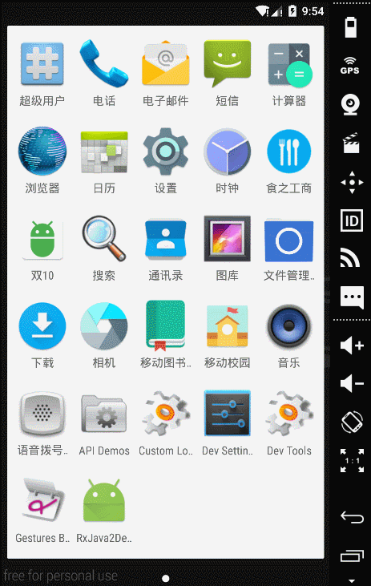

### 毕业设计系列之 --- 移动食堂（初学者项目）

### 项目技术要点（初学者）

1. 使用原生数据库做用户信息存储
2. xml文件的数据解析搭配列表显示
3. 封装了数据库的CRUD
4. ViewPager的基本使用
5. 调用隐示意图启动打电话界面
6. Android的基础控件和四大组件的部分使用

#### 项目开源协议
   协议？我不知道什么协议，你想用拿去用，不要钱，不涉及侵权那种。

   特别提醒 如果使用此项目做毕业设计如果和同学冲突，不是巧合只是你们懒而已。使用此项目 毕业设计论文答辩等挂了，作者鸡毛责任都不承担。

### 联系作者

Email: forJrking@sina.com

QQ :891378434
